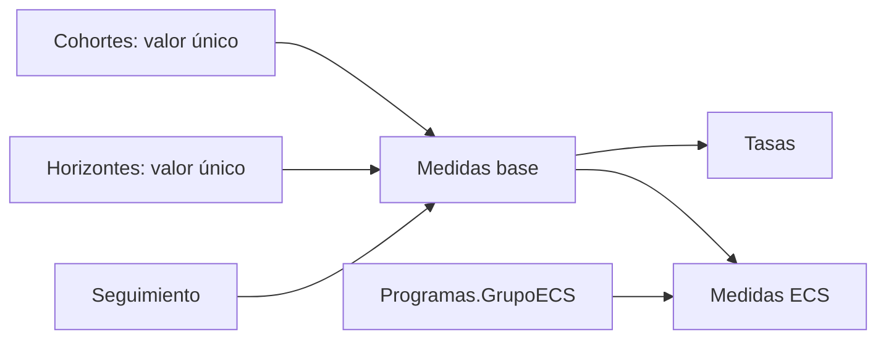

# 03 · DAX

## Estado auditado

El modelo semántico publicado en 3.3.1 contiene **65 medidas** separadas entre retención por `DISTINCTCOUNT(TrayectoriaID)` y flujos anuales por personas MRUN únicas. No contiene expresiones DAX de RLS/OLS.

## Familias de medidas

| Tabla / familia | Medidas | Unidad |
|---|---:|---|
| `Seguimiento`: retención, tasas, titulación, ECS y controles | 52 | Trayectorias deduplicadas |
| `Transiciones`: entradas, salidas, cambios y ausencia | 13 | Personas MRUN únicas por par anual |
| **Total** | **65** | Según familia |

Las medidas centrales son `N Base`, `N Carrera`, `N Institucion`, `N Educacion Superior`, `Tasa Carrera`, `Tasa Institucion` y `Tasa Educacion Superior`. Las tasas utilizan `DIVIDE` y respetan el anidamiento carrera ≤ institución ≤ educación superior ≤ base.

Las medidas de `Transiciones` cuentan MRUN distintos y separan cambio de carrera dentro de la misma IES, cambio de IES, llegada externa, salida hacia otra IES y ausencia de matrícula con o sin titulación acumulada. No se suman directamente con las medidas de trayectorias.

## Política de contexto vigente

Todas las medidas cuantitativas exigen exactamente una cohorte y un horizonte:

```dax
VAR _contextoValido =
    HASONEVALUE('Cohortes'[Cohorte])
        && HASONEVALUE('Horizontes'[AnioDesdeIngreso])
RETURN
    IF(_contextoValido, <expresión>, BLANK())
```

La interfaz selecciona por defecto cohorte 2024 y horizonte 2 donde corresponde, pero el DAX ya no sustituye silenciosamente una selección ausente o múltiple. `Estado selección` muestra una instrucción explícita cuando el contexto no es válido. Con esto se cierra **DAX-001**.

## Dependencias



## Controles automatizados

- No existe `COALESCE(SELECTEDVALUE(...), 2024/2)` en la definición.
- Cohorte y horizonte usan segmentadores de selección única.
- Se concilian las cuatro medidas centrales en las 120 celdas cohorte–horizonte.
- Se concilian nueve dimensiones contra los mismos conteos.
- El modelo usa `DISTINCTCOUNT(TrayectoriaID)` y mantiene `MRUN` sólo para controles de personas.

## Rendimiento y límites

El costo dominante sigue siendo `DISTINCTCOUNT` sobre 1,63 millones de filas y llaves de texto de alta cardinalidad. Antes de introducir claves sustitutas o agregaciones deben medirse Server Timings y tamaño VertiPaq. Las medidas de personas tienen semántica existencial y no deben rotularse como trayectorias.

## Convenciones

- `DIVIDE` para tasas y `BLANK()` cuando el contexto no es interpretable.
- Una medida por responsabilidad y columnas totalmente calificadas.
- Ningún corte temporal silencioso dentro de DAX.
- Cohorte/horizonte visibles y de selección única.
- Cualquier cambio debe volver a ejecutar `scripts/auditar_numeros.py` y `pytest -q`.
