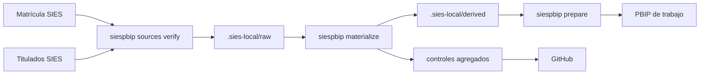

# 04 · Fuentes SIES, Power Query y materialización

## Linaje



## Contrato fijo

- Fuentes exclusivas: Matrícula y Titulados de Educación Superior SIES.
- MRUN obligatorio y convertido explícitamente a texto.
- RUT prohibido.
- Cobertura definida en `config/sies-pbip.yml`.
- Nombres, tamaños y hashes oficiales trazados en `datos/fuentes.json`.

Las fuentes deben descargarse desde el [portal oficial de Datos Abiertos](https://centroestudios.mineduc.cl/datos-abiertos/). En v1 no se automatiza la descarga: el portal y sus términos se revisan antes de cada nuevo corte.

## Capas locales

```text
.sies-local/
├── raw/
│   ├── matricula/
│   └── titulados/
└── derived/<proyecto>/
    ├── seguimiento_YYYY.csv.gz
    ├── programas.csv
    ├── cohortes.csv
    ├── horizontes.csv
    └── resultados_control.csv
```

Todo `.sies-local/` está ignorado. GitHub contiene únicamente `datos/controles_publicos/`, metadatos y hashes no individuales.

## Flujo

```powershell
uv run python -m siespbip sources verify --root D:\datos_sies
uv run python -m siespbip materialize --source-root D:\datos_sies
uv run python -m siespbip prepare --profile author
```

El PBIP canónico conserva:

```tmdl
expression 'Ruta datos' = "__PBIP_DATA_PATH__"
    meta [IsParameterQuery=true, Type="Text", IsParameterQueryRequired=true]
```

`prepare` copia el proyecto a `.sies-work/` e inyecta la ruta absoluta únicamente allí. `capture` vuelve a sanearla antes de incorporar cambios.

## Consultas M

| Partición | Entrada local | Operaciones |
|---|---|---|
| `Seguimiento` | `seguimiento_*.csv.gz` | filtro de nombres, GZip, CSV UTF-8, combinación y tipos |
| `Programas` | `programas.csv` | CSV UTF-8, catálogo y tipos |
| `Cohortes` | `cohortes.csv` | dimensión de cohortes |
| `Horizontes` | `horizontes.csv` | dimensión de observación |

## Controles

- Cobertura anual completa para ambas fuentes.
- MRUN no nulo, textual y sin pérdida de ceros iniciales.
- Ausencia de RUT y otros identificadores directos.
- Unicidad de trayectoria-año y claves del lado uno.
- Banderas limitadas a 0/1.
- Carrera ⊆ institución ⊆ educación superior.
- Hashes y conteos antes y después de materializar.
- Datos públicos sin MRUN, con umbral mínimo 10 y supresión complementaria.
