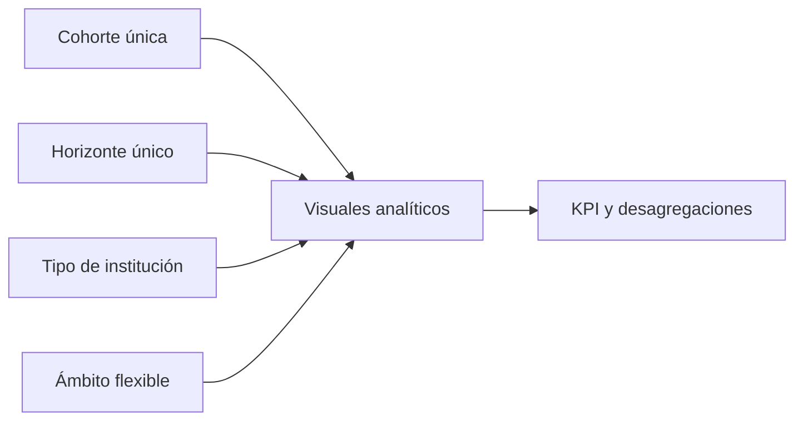

# 05 · Reporte

## Estado auditado

El reporte publicado 3.3.1 contiene 16 páginas y **211 visuales con identificadores únicos**. Conserva los identificadores de las siete páginas históricas y agrega nueve páginas de retención y movilidad anual.

## Inventario de páginas

| Orden | Página | Propósito | Visuales |
|---:|---|---|---:|
| 1 | Resumen nacional | KPI y comparación general | 13 |
| 2 | Cohortes | Evolución por cohorte/horizonte | 8 |
| 3 | Instituciones | Comparación por institución | 8 |
| 4 | Modalidad y jornada | Segmentos del universo flexible | 9 |
| 5 | ECS | Comportamiento específico de la escuela | 12 |
| 6 | Titulación | Titulación acumulada | 11 |
| 7 | Metodología | Definiciones, alcance y MRUN | 12 |
| 8 | ret_carrera | Retención de carrera y salidas educativas | 15 |
| 9 | ret_carrera_ipla | Retención y flujos de carrera IPLACEX | 15 |
| 10 | ret_carrera_ecs | Retención y flujos de carrera ECS | 15 |
| 11 | ret_institucion | Retención y flujos entre instituciones jurídicas | 15 |
| 12 | ret_ipla | Retención institucional y flujos IPLACEX | 15 |
| 13 | ret_ecs | Retención institucional y flujos ECS | 15 |
| 14 | ret_educacion_superior | Permanencia y ausencia de matrícula | 16 |
| 15 | ret_es_ipla | Permanencia y ausencia de matrícula IPLACEX | 16 |
| 16 | ret_es_ecs | Permanencia y ausencia de matrícula ECS | 16 |
|  | **Total** |  | **211** |

## Filtros y contexto

Las páginas históricas conservan sus filtros. Las nueve páginas nuevas fijan el horizonte 2 con un filtro bloqueado, usan cohorte de selección única con 2025 como valor inicial y exponen dimensiones de origen o destino con nombres explícitos. Las medidas muestran blanco ante un contexto inválido y `Estado selección` explica al usuario qué debe escoger.

## Página ECS

La página ECS muestra base, retención en carrera, retención institucional, continuidad en educación superior y movilidad interna. `GrupoECS` agrupa 171 y 426 para el foco, pero la retención institucional conserva separados ambos códigos jurídicos. Para cohorte 2025/horizonte 2, los controles son 2.299, 1.621, 1.655 y 1.767 respectivamente.

## Controles automatizados

- Dieciséis páginas en orden y 211 `visual.json`.
- Cero identificadores de visual repetidos.
- Posiciones dentro del lienzo 1600 × 900.
- Todas las referencias de columnas y medidas existen en TMDL.
- Identificadores únicos y referencias TMDL válidas.
- Cohorte única y horizonte 2 bloqueado en las nueve páginas nuevas.

## Validación operativa antes de publicar

1. Abrir y actualizar el PBIP sin mensajes de reparación.
2. Revisar títulos, orden de tabulación, contraste y textos alternativos.
3. Confirmar que cohorte/horizonte no admitan selección múltiple.
4. Comparar tarjetas con `datos/controles_publicos/resumen_retencion.csv`.
5. Verificar ECS 2025/horizonte 2 y ejecutar Performance Analyzer.
6. Confirmar que MRUN no aparezca en visuales ni drill-through.

La validación estática y numérica está cerrada. El usuario informó que el PBIP abre, actualiza e interactúa correctamente en Power BI Desktop; cada release futura debe repetir este control operativo.
