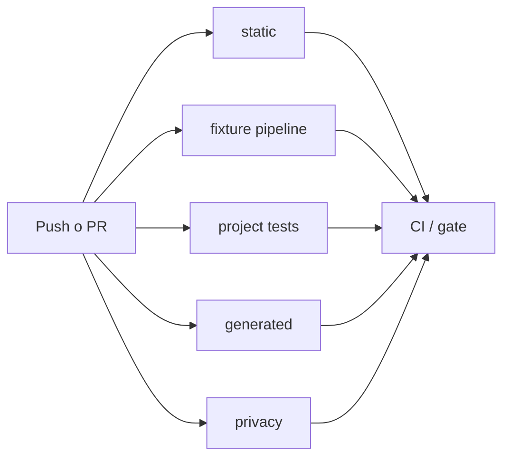

# 07 · Git, CI y releases

## Estado actual

| Capacidad | Estado |
|---|---|
| Repositorio público | Configurado en `amuletofloss/RETENCION_IPLA` |
| Fuente PBIP canónica | Este repositorio; un PBIP |
| CI | Implementada en `.github/workflows/ci.yml` |
| Revisión por propietario | `@amuletofloss` en CODEOWNERS |
| Datos | `external_mrun`; microdatos locales |
| Release 3.3.1 | Preparada con historial raíz limpio; publicación remota pendiente de autorización |
| CD a Fabric | Fuera de alcance de v1 |

## Flujo Git

- `main` protegida mediante ruleset.
- Ramas breves `feature/*`, `fix/*`, `docs/*` y `data/*`.
- Pull request, revisión del propietario y squash merge.
- Conventional Commits.
- Tags inmutables `vMAJOR.MINOR.PATCH` después de `release --check`.

El único check obligatorio será `CI / gate`. Se recomienda exigir una aprobación, resolución de conversaciones, historial lineal y bloquear force-push y eliminación de `main`.

## Integración continua

La CI valida configuración, JSON/PBIR/TMDL, documentación, CLI, fuentes sintéticas, privacidad, umbral 10, hashes y sintaxis JavaScript. Power BI Desktop no está disponible en runners Linux; la apertura, refresh, interacciones y accesibilidad quedan como evidencia manual obligatoria.

## Trabajo local

`prepare --profile author` crea un workspace ignorado. `capture --check` permite revisar el cambio y `capture --apply` incorpora exclusivamente los artefactos declarados. El bundle de release siempre nace de `HEAD`, nunca del working tree.

## Dependencias y cadena de suministro

- Python 3.12 y Node 22.
- `pyproject.toml` y `uv.lock` como resolución reproducible.
- Dependabot semanal para pip y GitHub Actions.
- Permisos mínimos de workflow.
- Caché, timeout y cancelación de ejecuciones obsoletas.
- CodeQL y dependency review cuando la configuración del repositorio lo permita.

## Releases

Antes de publicar una versión se requiere:

1. CI verde y working tree limpio.
2. Versiones sincronizadas en config, manifiestos, changelog y CITATION.
3. Ausencia comprobada de microdatos, identificadores fila a fila y rutas personales.
4. Evidencia manual completa de Power BI Desktop.
5. Controles agregados y hashes actualizados.
6. Ningún microdato real, ruta personal, secreto o marcador de gobierno.

`release --bundle` crea ZIP y `SHA256SUMS` mediante `git archive`. Publicar el tag o GitHub Release es una acción separada del propietario.

## Configuración externa pendiente

- Activar el ruleset de `main` con `CI / gate`.
- Confirmar Private Vulnerability Reporting y secret scanning.
- Definir un canal privado alternativo en `SECURITY.md`.
- Completar los aprobadores nominales de datos y privacidad.

No se incorporarán tenant, workspace IDs, credenciales ni despliegues Fabric hasta aprobar otro ADR.
